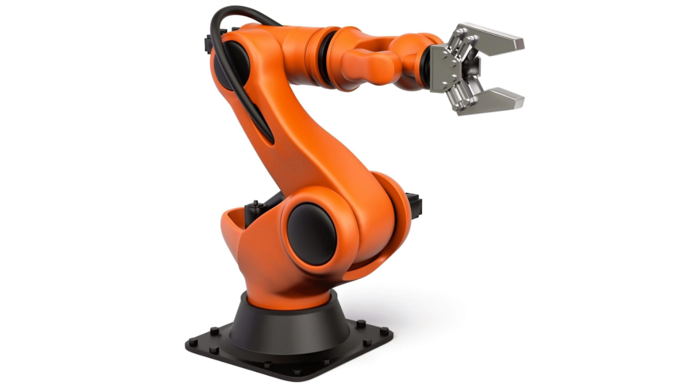
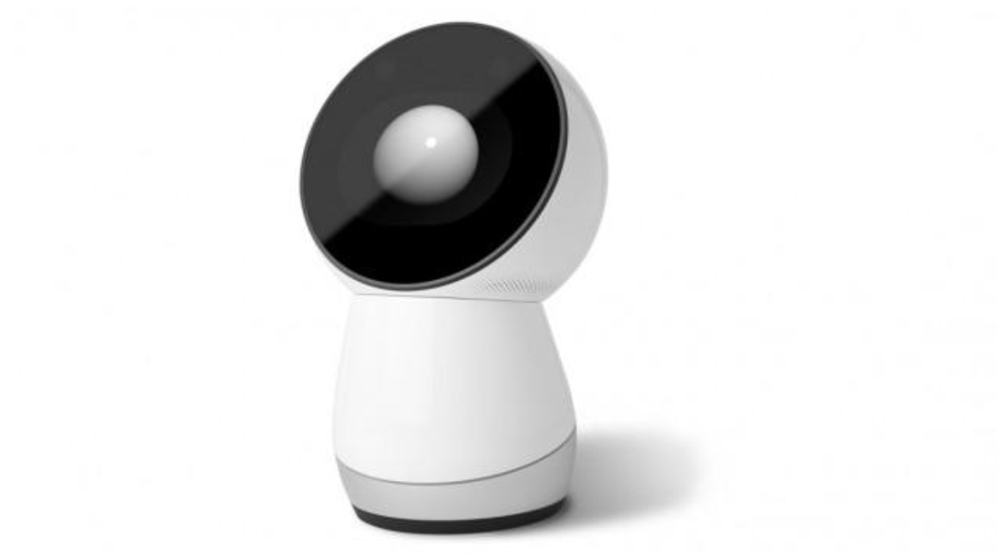

# Wat is een robot?

*Welke robots heb jij al gezien?* 

In 1495 ontwierp Leonardo da Vinci een ‘mechanische leeuw' die kon voortbewegen op basis van mechanische principes. Maar pas in 1961 mocht de industrie de eerste robot verwelkomen: de Unimate. Deze robotarm kon je programmeren om taken zelfstandig uit te voeren. Nieuwere, betere versies van de Unimate worden vandaag nog altijd gebruikt, bijvoorbeeld voor microchirurgie: operaties op piepkleine dingen in het lichaam.

Naast robotarmen voor fabrieken, gingen onderzoekers rond 1950 ook robots met poten bouwen. De meest bekende afstammelingen hiervan zijn ongetwijfeld Honda’s ASIMO (die op een menselijke lijkt) en Sony’s Aibo (een robothond).

Bovendien houden onderzoekers zich niet alleen bezig om robots te laten bewegen (de mechanische bouw): ze focussen ook meer en meer op de sociale vaardigheden van robots. KISMET van MIT, uit de jaren negentig, kan bijvoorbeeld naar je lachen. Robots met gelaatsuitdrukkingen worden onder andere ingezet aan de balie in hotels of ziekenhuizen.

