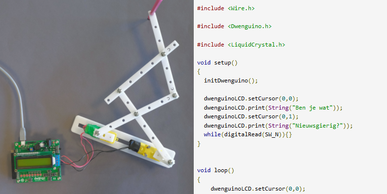

# Wat is een robot?

*Waaruit bestaat een robot?* 

Een robot bestaat uit hardware (zijn lichaam, met bedrading, rekeneenheid en batterijen) en software (het programma dat hem aanstuurt).  

Het ‘lichaam’ van een robot bevat bewegende, mechanische onderdelen uit verschillende materialen: wielen, een arm, een hoofd... De robot heeft sensoren (ingangen) om dingen te ‘voelen’ en actuatoren (uitgangen) om dingen te ‘doen’. Hoe meer soorten sensoren of ingangen robots hebben, hoe meer ze kunnen voelen. Zo zijn er sensoren om afstanden te kunnen meten, te voelen waar de grond is, te detecteren of er licht schijnt, of zelfs om geluid te horen. Hoe meer actuatoren of uitgangen robots hebben, hoe meer ze kunnen doen. Op een lcd-scherm kunnen ze tekst of beelden tonen, met een zoemer kunnen ze geluid maken, en met een servomotor kunnen ze dingen doen bewegen.

Jouw computer heeft ook in- en uitgangen. Het toetsenbord en de muis zijn voorbeelden van ingangen; het scherm is een uitgang. 

We weten nu al dat robots dingen kunnen voelen met hun sensoren en dingen kunnen doen met hun actuatoren. Maar kunnen ze ook denken? En hoe maken ze beslissingen? Daarvoor gebruiken robots een rekeneenheid, zoals een processor (zoals in een computer) of een microcontroller (zoals op de Dwenguino). Met zo'n microcontroller gaan jullie zo meteen aan de slag. Je ziet hieronder een afbeelding van de Dwenguino.

In een robot zitten ook nog kabels of bedrading. De bedrading verbindt de rekeneenheid, de sensoren en de actuatoren met elkaar. Hoe de robot zijn actuatoren aanstuurt, hangt af van de informatie die hij verzamelt via zijn sensoren en van de manier waarop de rekeneenheid geprogrammeerd is. En uiteraard kan een robot dit alles niet zonder energie. Daarom bevat een robot ook batterijen.

Een robot kan alleen een bepaalde taak uitvoeren als zijn rekeneenheid daarvoor geprogrammeerd is. Die taak ligt niet per se vast: je kan de rekeneenheid telkens opnieuw zo programmeren dat de robot een andere taak vervult. Die taak kan bovendien afhangen van de informatie die de microcontroller via de ingangen krijgt, maar als het programma op de microcontroller er niets mee doet, heeft deze informatie geen effect.

Benieuwd wat jouw tekenrobot zoal kan? Je zal hem zo programmeren dat hij telkens opnieuw een tekening maakt.
